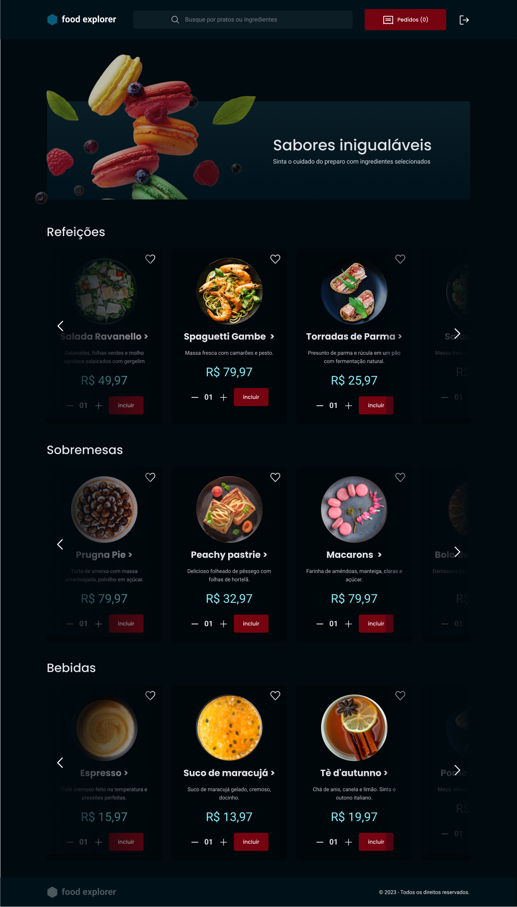

<h1 align="center">  Food Explorer - BackEnd</h1>

Food Explorer - BackEnd

  <a href="#-tecnologias">Tecnologias</a>&nbsp;&nbsp;&nbsp;|&nbsp;&nbsp;&nbsp;
  <a href="#-projeto">Projeto</a>&nbsp;&nbsp;&nbsp; | &nbsp;&nbsp;&nbsp;
  <a href="#-acesso">Acesso</a>&nbsp;&nbsp;&nbsp;|&nbsp;&nbsp;&nbsp;
  <a href="#-deploy">Deploy</a>&nbsp;&nbsp;&nbsp;
  

 

  

## 🚀 Tecnologias

Esse projeto foi desenvolvido com as seguintes tecnologias:

- Node
- Express
- CORS
- Knex
- Dotenv
- JWT - JSON WEB TOKEN
- BCrypt
- SQLite
- Multer
- PM2

## 💻 Projeto

Informações importantes sobre o pojeto:

Ao baixar ou clonar o projeto execute no terminal da aplicação:

- npm i : Para instalar as depêncencias necessárias para funcionamento correto da aplicação.

- npx knex migrate:latest : Para gerar o banco de dados (database.db)

- npx knex seed:run : Para subir os arquivos no banco de dados.

- npm run dev : Para iniciar a aplicação.

## 👨‍💻 Acesso

Você precisará executar o frontend da aplicação disponível no repositório abaixo:

https://github.com/viniciuszmota/foodexplorerfrontend

## 👨‍💻 Deploy:

Endereço: https://foodexplorervini.netlify.app/

---

Feito com ♥ by Vinicius Zamprogno, estudante na Rocketseat 👋
